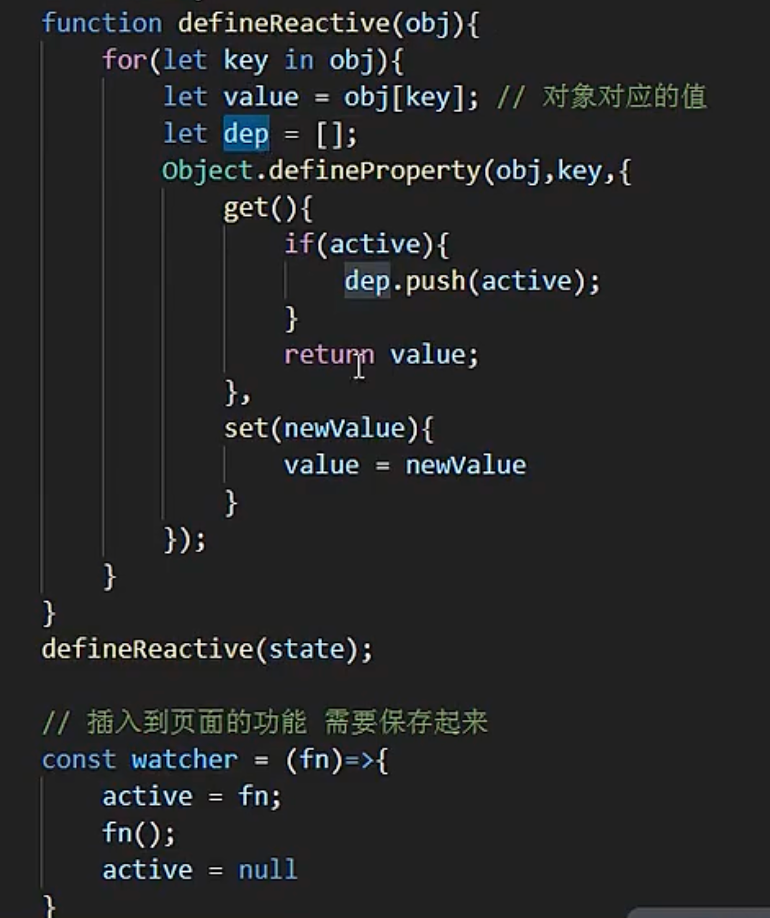

### Dob 响应式问题相关

前沿技术 https://github.com/ascoders/weekly/tree/master/%E5%89%8D%E6%B2%BF%E6%8A%80%E6%9C%AF

**dob 的响应式实现解读**

> https://github.com/ascoders/weekly/blob/master/%E5%89%8D%E6%B2%BF%E6%8A%80%E6%9C%AF/35.%E7%B2%BE%E8%AF%BB%E3%80%8Adob%20-%20%E6%A1%86%E6%9E%B6%E5%AE%9E%E7%8E%B0%E3%80%8B.md
> issue https://github.com/ascoders/blog/issues/23
> github 仓库 https://github.com/dobjs/dob
> 官网 https://dobjs.github.io/dob-docs/

@Action 用于标记一个方法，使其成为一个动作（Action）。在 dob 的响应式编程模式中，动作是修改可观察对象（observable）状态的唯一方式。使用 @Action 装饰器的目的是为了明确地区分状态的读取和修改，以及提供更好的性能和调试体验。

- 使用方法
- 标记方法为动作：通过在类方法前添加 @Action 装饰器，该方法内部对可观察对象的修改将被 dob 捕获，并作为一个事务处理。这意味着方法内的所有状态修改将被合并，并在方法执行完毕后统一更新，这有助于避免不必要的重复渲染和计算。
- 事务性修改：@Action 装饰的方法内部可以包含多个状态修改操作，dob 会将这些操作视为一个整体（事务）。只有当整个动作执行完毕后，相关的观察者（Observer）才会被通知状态变化，触发更新。
- 调试与性能优化：使用 @Action 可以帮助开发者更清晰地理解状态是如何和何时被修改的，同时也便于 dob 提供更优化的性能表现。因为 dob 可以减少不必要的状态变化通知和观察者检查。

如果不使用 @Action 装饰器对状态修改进行标记，可能会遇到以下问题：

- 性能问题：在没有将状态修改封装在 @Action 中时，每次对可观察对象（observable）的修改都可能触发观察者（observer）的重新计算和组件的重新渲染。如果在一个方法中有多次状态修改，那么这些修改每一次都可能导致观察者的更新，从而引起不必要的性能开销。使用 @Action 可以将一个方法内的所有状态修改合并为一个事务，只在方法执行完毕后统一通知观察者，从而提高性能。
- 不一致的状态：在没有使用 @Action 的情况下，如果一个方法中有多个状态修改操作，而这些操作之间的状态是相互依赖的，那么在这个方法执行过程中，观察者可能会观察到部分更新的状态，这可能导致应用的状态出现不一致或者逻辑错误。

- observe 是 dob 库中用于将 React 组件变为响应式组件的装饰器或高阶函数。当被 observe 装饰的组件使用了可观察对象（observable）中的数据时，一旦这些数据发生变化，组件会自动重新渲染。
- observable 是 dob 库中用于将普通对象、数组或类实例变为可观察对象的函数。这意味着，一旦这些对象的属性发生变化，所有依赖这些属性的响应式组件或计算值（computed value）会自动更新。

```javascript
import { observe, Action, observable, Static } from 'dob';
import { observable, Action } from 'dob';
import { observe } from 'dob-react';

class Store {
  @observable count = 0;
  @Action
  increment() {
    this.count += 1;
  }
  @Action
  decrement() {
    this.count -= 1;
  }
}

const myStore = new Store();
myStore.increment(); // 此时 count 从 0 变为 1，且作为一个动作处理
// 在这个例子中，increment 和 decrement 方法被 @Action 装饰器标记，因此它们对 count 的修改被视为动作。
// 这意味着，无论这些方法内部有多少次对 count 的修改，外部的观察者只会在方法执行完毕后接收到一次状态变化的通知。

import { observe, Action, observable, Static } from 'dob';
const appState = observable({
  title: 'Hello, dob!',
});

@observe
class App extends React.Component {
  render() {
    return <h1>{appState.title}</h1>;
  }
}
// 或者使用高阶函数的方式
// const ObservedApp = observe(App);
在这个例子中，App 组件通过 observe 装饰器变为响应式，当 appState.title 发生变化时，App 组件会自动重新渲染。

@observable
export class UserStore {
  name = 'bob'
}
@Connect  // 自动将 UserStore 中的数据注入到 App
class App extends React.Component {
  render() {
    return <div>{this.props.userStore.name}</div>
  }
}

// 一句话描述就是：由 observable 产生的对象，在 observe 回调函数中使用，当这个对象被修改时，会重新执行这个回调函数。
import { observe } from 'dob'

componentWillMount() {
  this.signal = observe(() => {
    this.fetch({ url: this.props.url, userName: this.props.userName })
  })
}
this.signal.unobserve()
// 其神奇地方在于，observe 回调函数内用到的变量（observable 后的变量）改变时，
// 会重新执行此回调函数。而componentWillReceiveProps 内做的判断，其实是利用
// react 的生命周期手工监听变量是否改变，如果改变就触发请求函数，然而这一系列操作都可以让 observe 函数代劳。

// observe 有点像更自动化的 addEventListener：
// 所以组件销毁时不要忘了取消监听：

// 准确区分出业务与非业务组件、写代码前先设计数据流的依赖关系、异步时注意分离，
// 就可以解决绝大部分业务场景的问题，实在遇到特殊情况可以使用 observe 监听数据变化，
// 由此可以拓展出比如请求自动重发的功能，运用得当可以解决余下比较棘手的特殊需求。
```

**响应式最小化 demo 实现**


**Mobx 的响应式实现**
https://www.bilibili.com/video/BV1rB4y1j7fL/?spm_id_from=333.337.search-card.all.click&vd_source=ceba6fa4ea92478c52c3119bd474a7ab


> autoRun(() => {}) 函数是 Mobx 的核心，它会自动执行所有依赖于响应式数据的函数。类似于 dob 的 observe 装饰器，但 Mobx 的实现更加复杂。
