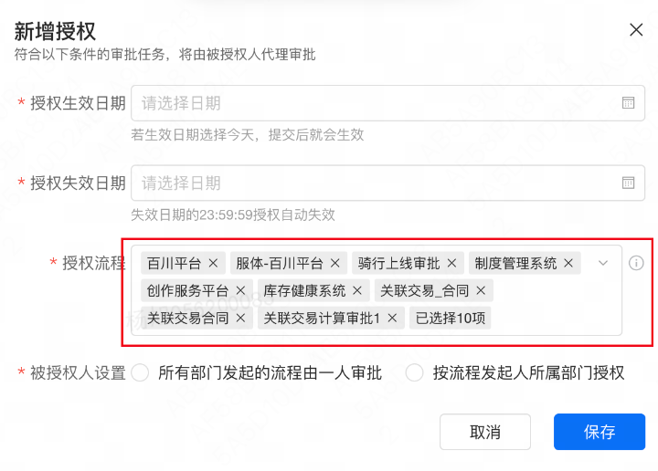
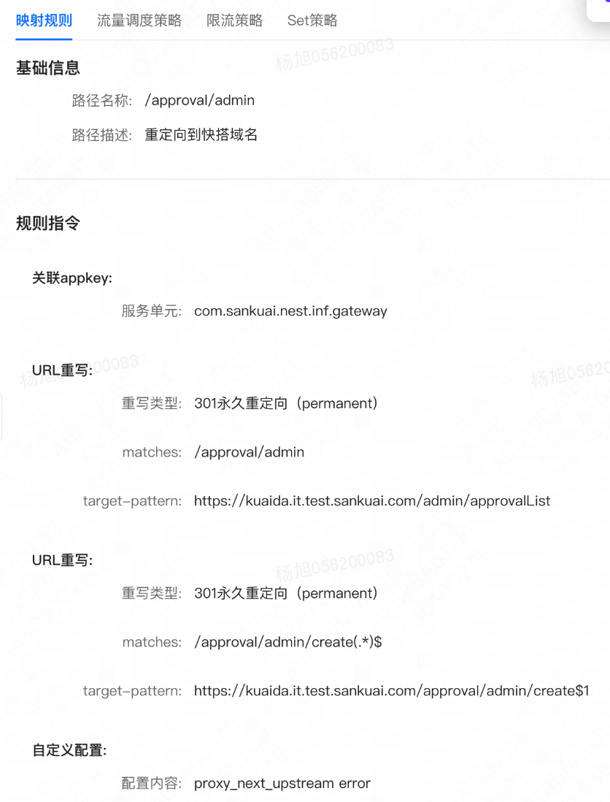
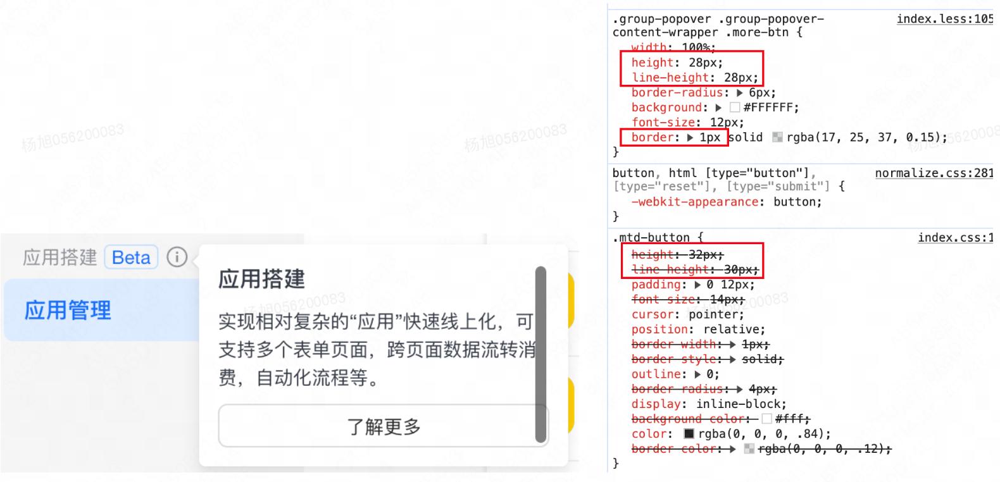

**git diff --stat HEAD~1 最近一个 commit 代码量**
日程/tt/问卷：稳定性建设、排障、线上告警；虚拟渲染；接口限制

TODO：
例会可以聚合填写、不同的需求会议不能整合，同一需求可以整合、运维（tt 值班、告警值班等等）
截止到 6 月的代码提交量（包含首月线上存量缺陷修复任务：9 个）
代码提交量 6w+，千行 bug 率最低，bug 最少，https://yuntu.sankuai.com/v3/potency/person?config=param-f3b3107d-7347-457d-baec-0446b0b4054f
代码提交量 6w+，千行 bug 率最低，bug 最少，https://yuntu.sankuai.com/v3/potency/person?config=param-f3b3107d-7347-457d-baec-0446b0b4054f

**daily notes**
9.18：开发/联调开放平台的 EDI-AI 需求跳转功能
9.14：埋点，shenpi-mobile 下的业务参数 确认 pdCode: pdId spmis：mis terminal： ​ bpmCode，大象快审是 templateId
PcAllDetailPage: 'c_oa_p0rzve6o', // PC 端全部审批详情页，是否需要改过来，只包含快搭审批详情页

9.12：连接器三期-工作流新增创建大象群连接器开发，官方连接器 schema 范式统一抽象

9.2-9.6：连接器技术方案 2.5pd，连接器开发 2pd

8.26：技术方案编写，排障两个，技术评审会 2 个：doa 优化、连接器，
8.27：doa 专项调研，半小时https://km.sankuai.com/collabpage/2447317558
8.28：连接器开发 demo，千寻工单支持 1h，写文档等，
用户访问系统图片裂开，无法正确显示问题，报错跨域问题，通过 fetch 复现成功，credentials 属性设置为 include 时，服务器的 Access-control-allow-origin 属性不能设置为 '_'，include 啥意思。当设置 credentials: 'include' 时，服务器端也需要在响应头中正确设置 Access-Control-Allow-Credentials 为 true，并且 Access-Control-Allow-Origin 不能设置为 _，必须是明确的、请求来自的域名。
凭证模式（credentials mode）是 Fetch API 和 XMLHttpRequest（XHR）请求中的一个设置，用于指定跨域请求是否应该包含凭证信息，如 Cookies 和 HTTP 认证信息。在 Fetch API 中，这通过  credentials  选项来设置。
凭证模式选项
omit：默认值，意味着对于跨域请求，浏览器不会发送任何凭证（cookies、HTTP 认证等）。对于同源请求，浏览器会自动发送凭证。
same-origin：只有当 URL 与调用脚本位于同一源时，浏览器才会发送凭证。对于跨域请求，不会发送凭证。
include：无论是跨域请求还是同源请求，浏览器都会发送凭证。

8.23：连接器调研、kuaida-admin 项目存在 git stash 暂存记录
8.18-19：使用学谦的 onEffect 最小化 dob 响应式 demo 实现；单独添加组件测试 reaction 数量

8.14：bugbash、技术方案，oneone
8.15：部署 snapshot 网站，调研连接器
snapshot 对比：feature/CLRXO-85547198/snapshot-screenshot-test
8.5-6：联调、打通 snapshot 数据存储和接口请求，还缺少场景定义和用例实现
7.29：snapshot 跑测试，出报告、快搭 1.7 发布
7.30：开平侧开发 test load time 8.567 联调 8.9 号联调多语言
响应式测试：100 组件，10 个条件组显隐配置，没问题
8.1：开平多语言开发，squirrel 数据库了解
8.2：tt 值班，

7.23：新增组件，超过预设值就要删除一部分组件，基于预设值的组件数量在页面中模拟点击，复制，添加，查看画布中组件数量，判断是否正确渲染，来判定此时是否有 bug
修改属性时长为例，继续细化：比如设计全局校验的属性、不含校验的属性、唯一性校验的属性；测试 10 次取平均值（学城，表格）
支持配置细化：比如组件上限测试中，复制几个组件

7.15：tt 值班
7.16-7.17：联调 DOA，开放平台评审会、
7.18：走查问题优化、bugbash 问题修复、开放平台技术方案会、给开平排期
被授权人修改之后 - 点击 Checkbox，会触发对应条规则的 rerender，原因是每个 rule 都有一个 key，授权人变化的时候 onChange 出去的 model 直接修改了对应的 rule，conditionRules[index]，应该仅修改对应 rule 的 agentUserId 和 agentUserName
7.19：
7.8：​ 开发 doa， 20 上限缺陷修改
7.9、7.10：开发 doa，这个 icon 如果设置成 flex 居中，当组件校验错误时会和组件不居中，如果设置绝对定位，又会导致和选项框不居中

7.11：需求 侧边栏应用链接配置帮助文档修改 [已上线]开发者后台帮助文档链接修改
7.1：
资源管理平台发布，测试问题解答
doa 授权优化调研：4.5PD，https://km.sankuai.com/collabpage/2250540988#id-%E6%96%B0%E6%96%B9%E6%A1%88
iPad 问题：2.5PD，高优 5 个
7.2：线下性能卡控技术方案书写，开放平台 v0.5 发布
7.3：技术方案 DOA，开发 DOA
7.4：选人组件涉及：1.0 前后台升级最新包（是否有上限？），2.0 后台条件组编辑，审批任务和抄送任务缺陷 【快搭 2.0】后台-编辑权限组页面-添加成员选人组件，右侧面板不应该展示 20 上限 [已关闭]，修复之后，将最新的包进行升级
改造条件筛选组件 UI -> AgentConditionModal
7.5：开发审批授权高级配置组件

6.24：开平开发，周会
6.25：开平
6.26：联调
6.27：tt 值班；快搭没东西；开平；
6.17：修改 1.0 后台子应用路径支持泳道域名访问、三方审批菜单权限逻辑修复、周会、5 月质量复盘会、对齐快搭性能测试细节问题
6.18：重新发布并安装审批流组件包，协助 qa 测试审批流组件报错渲染，开发开平
6.19：修复 bug，开发资源管理平台 0.7PD，0.2PD 看测试
6.20：完成快搭线下性能卡控建立文档https://km.sankuai.com/collabpage/2313326614
、修复提测 bug、DOA 需求评审
6.21：开发开平

6.11：周会、资源管理平台所有者开发、1.0 前台跳转后台链接优化
6.12：tt 值班（3/5PD），puppeteer 了解

> - 首先操作逻辑的脚本如何实现？
>   通过 chrome 插件自动生成 js 脚本 or 人工手写关键链路？
> - 如何验证测试的正确性？
>   最终链路执行结束之后生成 snapshot（人工手写代码获取元素执行逻辑，并对最终的截图进行打标），执行测试案例之后生成的 snapshot 通过插件或者 ai 与正确图片进行对比，可以人工设置一个阈值，来判断此次测试是否正确
>   使用 jest 对关键逻辑位置进行单独判断，比如点击之后是否发生跳转 describe('test describe', () => { test('test example', () => { expect(1).toEqual(1);});})

6.13：熟悉 puppeteer
6.14：跑起来 demo，开发资源管理平台
6.3：tt 大象独立窗口问题、小语种部署问题分析、参加会议（数据导出页出现滚动条，分析及讨论）
6.4：修复小语种问题上线、修复
6.5：坚哥 bugbash、kuaida-app 审批详情页部门展示优化成省略号、v0.5 开平技术方案 1h、产品走查缺陷 【快搭 1.0】移动端或者侧边栏查看离职调岗流程的基本信息，发起部门展示空白（建议没有展示-或者不展示） [已关闭]、kuaida-app 升级了包，还未合入 release，shenpi-mobile 有 bugfix，还未合入 release
6.6：走查问题修复（指定人员信息展示包含了 id）、bugfixhttps://km.sankuai.com/collabpage/2296401988#b-f7b17bce7ee340ba9168958da7e32e35
、1.0 后台指定审批人回显时缺少 mis 号（存量问题）暂不修复，涉及条件分支使用 value、开放平台 tt 答疑

**20240527-0531**
5.27/5.28：修复权限，上线开平 v0.4 版本
5.29：小语种修复发布问题分析https://km.sankuai.com/collabpage/2283525219
、开放平台 v0.5 迭代 二次评审
**20240520-0524**
5.23 开平测试，预留 1PD 的 bug 修复和支持
快搭 v1.6 迭代 6PD
https://km.sankuai.com/collabpage/2262828138
https://km.sankuai.com/collabpage/2233320974
3 个 P0 1.5PD；3 个 P1 待定
https://km.sankuai.com/collabpage/2260543670
3 个 P0 1PD；3 个 P1 0.5PD
开放平台 v0.5 迭代
评审 约 6-7PD
告警值班 1pd
**20240513-0517**
快搭 v1.5 迭代
新老快搭入口融合（一期）
测试中
bugfix：缺陷 【MVP-V1.5】从审批中心右上角跳转到管理后台 404 [已关闭]
缺陷 【MVP-V1.5】规范化审批表单详情页表单下面留白过多，实际不需要滚动条且首屏宽度下【到业务系统查看更多信息】展示不全 [已关闭]
windows 电脑上某些字体不兼容 font-weight：500 的字重，没有被加粗显示，是否需要统一设置 bold
https://km.sankuai.com/collabpage/2260041081
阅读 jimu 文档
开放平台 v0.4 迭代
开放平台-V0.4 管理后台优化
联调中，预计 5.23 提测
开放平台功能优化搜索、状态码删除
**20240507-0510**
今日工作：
快搭 v1.5 迭代
新老快搭入口融合（一期）
测试中
入口融合上线发布流程说明
打开大象桌面端公众号方法大象桌面端桥链接使用指北
bugfix：缺陷 【MVP-V1.5】快搭审批操作审批时表单字段校验失败没有锚定到错误位置 [已关闭]
开放平台 v0.4 迭代
开放平台-V0.4 管理后台优化
联调中，预计 5.23 提测
tt 值班

**20240424**
今日工作：
新手引导开发完成，至少完成新增页面埋点「后台列表页已完成」✅
shenpiAdmin 使用审批域名时出现跨域问题，导致子应用加载不出来，不能用 / ，应该直接用 curShenpiUrl，斜杠会默认访问到快搭域名
最终使用的是 kuaida 域名访问 1.0 后台，避免跨域问题不好解决，出来更多问题
可以看到尽管 entry 中配置了 approval,但 url 也需要传入完整路径，即/approval/admin/approvalList，否则将会到 1.0 的 404 页面
原因：nest 上配置了根域名 kuaida.xxx.com/访问的是前台 app 服务，后台服务配置的是 kuaida.xxx.com/admin，首先被前台劫持了，所以最开始一直渲染的是前台的 404 页面，后来发现 nest 上 1.0 后台配置了 kuaida.xxx.com/approval 访问，所 l 以这里 entry 需要加上/approval，保证访问子应用时首先能够进入到 1.0 后台部署的服务下，再传入路由路径即可
点击展开内容
{
name: 'shenpiAdmin',
// entry: deployEnv === 'test' ? '/' : curShenpiUrl,
entry: curShenpiUrl, // { script: string[], styles: [] }
}
UAC 权限申请链接，待后端给 ✅
无权限页统一跳转到无权限页，三方审批单独 uac，当前后台整体鉴权接口：/zeroconsole/permission/authView ✅
难点：admin 加载了两个子应用，需要考虑不同资源对应的静态资源路径问题 publicPath 如何设置，通过 settings:{getPublicPath 获取} ✅
在使用 qiankun 做微前端的过程中，子应用在主应用（基座）的过程中出现静态资源 404 问题，原因是子应用放入到基座中后，静态资源会默认走主应用地址去访问，但是主应用又没有这些静态资源文件，其结果显而易见，肯定是 404 了。
使用到了 js 代码注入到 html 中 ❌

```javascript
// 快搭admin & 快搭app 域名
test/st：window.publicPath = '//awp-assets.sankuai.com/in/kuaida-app/'
prod：window.publicPath = '//awp-assets.meituan.net/in/kuaida-app/'

test/st：window.publicPath = '//awp-assets.sankuai.com/in/kuaida-admin/'
prod：window.publicPath = '//awp-assets.meituan.net/in/kuaida-admin/'

headScripts：
window.publicPath = window.__INJECTED_PUBLIC_PATH_BY_QIANKUN__ || `//awp-assets.${isProd ? 'meituan.net' : 'sankuai.com'}/in/kuaida-app/`;
window.__INJECTED_PUBLIC_PATH_BY_QIANKUN__ = window.publicPath;
window.__webpack_public_path__ = window.publicPath;

// 审批1.0后台域名
test：window.publicPath = '//onejs.meituan.net/v1/mss_29f02df7dcb14a83951095a86f204dfb/test/jimu-approval-editor/'
st：window.publicPath =   '//onejs.meituan.net/v1/mss_29f02df7dcb14a83951095a86f204dfb/staging/jimu-approval-editor/'
prod：window.publicPath = '//onejs.meituan.net/v1/mss_29f02df7dcb14a83951095a86f204dfb/prod/jimu-approval-editor/'
      settings={{
        getPublicPath:
          // deployEnv !== 'development'
          deployEnv === 'development'
            ? (entry) => {
                console.log(
                  '传入子应用的 entry',
                  entry,  // localhost:8001
                  window.publicPath,  //awp-assets.sankuai.com/in/kuaida-app/test-my-publicPath
                  new URL(window.publicPath, window.location.origin).toString() http://awp-assets.sankuai.com/in/kuaida-app/test-my-publicPath
                );
                return new URL(window.publicPath, window.location.origin).toString();
              }
            : undefined
      }}
```

**20240423**
今日工作：
入口融合开发：header 优化，新手引导，方案评审，完成 Todos
TODO：域名重定向，还是使用 /admin/myApp/approvalList
nginx 配置 需要给定起始和结束，否则都会调到 approval/admin - admin/approvalList

**popover 组件出现滚动条排查：**
因为按钮本身 line-height 是 30px，上下边框各占 1px，所以高度应该设置 32px，见 myd-button 原样式，所以要么不设置行高，要么加上 2px 的边框高度，即 30px
你的按钮设置了 1px 的边框。在 CSS 的标准盒模型中，元素的最终可视高度包括了内容的高度、内边距（padding）、边框（border）和外边距（margin）。当你设置元素的 height 为 28px，这个高度不包括边框。因此，实际的元素高度会是 28px + 1px（上边框）+ 1px（下边框）= 30px，这可能导致父容器出现滚动条

**20240417**
参加学谦评审会
开发 & 技术方案
**20240415**
参加两场评审会
2h 入口开发
技术方案书写
**20240412**
4.12 hotfix 缺陷 【快搭 1.0 线上】审批详情页审批说明中，鼠标移动到流程负责人姓名 vCard 上时，hover 出来的卡片和实际流程负责人不一致 [打开]
参加校验评审、开平后端技术方案
产品对齐入口融合
**20240411**
融合入口文档，确定选型方案
**20240410**
开平超管权限 api 入参出参仅支持增加调研，需禁用已上架资源现有的字段，仅支持新增
融合入口文档
**20240409**
融合方案 demo 测试，包括链接跳转，微前端方案，参加评审
开平优化需求，连接器申请权限跳转资源管理平台锚点调研 demo
**20240408**
协助开平后端处理 tt 问题
入口融合方案 demo 测试
**20240407**
修复泳道访问后台时，打开前台 host 不对的问题 PR in/kuaida-app feat: 兼容 url 前缀拼接泳道的访问模式 [merged]
**20240402**
回复 qa 测试 bug，确认归属方
分析告警根因 tt 值班
**20240328**
修复产品走查问题，提测
开放平台 v0.3 发布上线
**20240327**
和后端产品沟通后，暂定前端修复供应商权限问题
快搭审批和快搭应用埋点
修复产品走查问题
20240326
协助客户排查资源管理平台问题：上传文件无法弹框
优化 1.4 改版走查问题
协助后端解决资源管理平台资源供应商权限问题
20240325
自测改版内容
20240322
开发基本完成，待埋点
20240318-20
四大详情页 ui 改造完成
联调完成开放平台 v0.3 优化
20240314
修复老应用点击关闭跳转链接不正确 bug
申请线上域名 xopen.sankuai.com ​ 可访问
20240313
修复 第一次调试不展示公告问题
tt 值班
设计改版
调试
20240311
申请 prod 域名
联调开放平台 v0.3 需求
20240306
20240305
开放平台 v0.3 需求
上线 链接转卡片需求
20240304
开放平台 v0.3 需求
20240301
开放平台 v0.3 需求
20240229
调研域名申请操作，创建 xopen.xm.test.sankuai.com，并迁移前后端服务
20240228
参会 开平 v0.3 后端技术方案，确定排期
20240227
完成审批详情页无权限页开发，和坚哥确认了实现方案
提测 bug
20240226
修复 报错“pdId 必须大于 0”
提测链接转卡片需求
20240223
修复卡片点击关闭按钮报错系统异常问题修复
tt 值班
20240222
开发链接转卡片【联调完成】
参会
20240221
开发链接转卡片【联调】
参会
20240220
开发链接转卡片需求 100%
20240219
开发链接转卡片需求 50%
20240201
已修复，快搭 1.0，分支未命名，v1.3 上线：缺陷 【快搭 1.0】流程导出数据过期后点击重新查询->查询并导出后，报错“pdId 必须大于 0” [已关闭]
已修复，fix/sign-border-0201 未上线：缺陷 【快搭】Windows 上加签内边框展示不全 [已关闭]
tt 值班++
20240131
修复：缺陷 【MVP-V1.2】移动端：审批任务转交后，原审批人点击消息卡片上“审批详情”，进入详情页后点击页面左上角返回箭头页面刷新，预期是返回到审批公众号会话页 [已关闭]
排查 bug：缺陷 【快搭】Windows 上加签内边框展示不全 [已关闭]
20240130
校招生述职
20240129
写述职文档
20240125
修复用户鉴权优化问题并提测
写述职文档
20240124
修复走查问题 & 走查优化
去掉 integer 类型、UI 优化、字段名称 icon 移到 placeholder、增加必填标识、字段名称校验（2-20 个字符、中文、字母、数字和下划线）
20240123
联调用户鉴权 & 连接器二期
修复：执行动作出参嵌套时无法连线（JsonMappingEditor 映射关系回显时只解析的一层嵌套）
固定值无法回显：花了老旧定位到这里，后端返回的 MappingRules 在这里被修改了，导致固定值 rule 被过滤掉，一直无法回显
20240122
开发用户鉴权 & 连接器二期联调
20240115
doa 问题联调发布测试
连接器最新 prd 优化部分内容
tt
doa 线上高优问题需求
开发 1.16 提测，1.19 上线？？
流程肖邦文案修改：
流程工厂 & bpmn-editor（feature/yx-v1.1.1）
jimu-approval-editor（feature/doa-v1.1.1）
审批流找人报错：
jimu-components/ApprovalFlow 组件：feat/doa-v1.1.1
shenpi-web：依赖 feat/doa-v1.1.1 验证 OK
kuaida-app：依赖 feat/doa-v1.1.1 验证 OK
20240112
开
映射关系连线回显和固定值回显，他们的作用位置不同，同时又分为入参映射和出参映射，对应到左右两侧的节点也不一致，导致数据回显时的解析 requestMapping.rules 时需要分两种情况处理
取消连线时，发现之前的 rule 还在，没有被删除掉，排查发现：rules = rules.filter((rule) => rule.value !== `$.${transformId2Field(left.id)}`);之前对比的是 rule.key，
连线回显时遇到 svg 里的 path 报错，因为判断逻辑是 node.linkIndex === null，但是我添加映射关系的时候，可能没有 linkIndex，导致 node.linkIndex 时 undefined，导致 path 路径 endY 为 null 保存
图片上传报错待添加：done
固定值设置样式：
20240109
开发连接器二期：0.5PD 开发，开会一堆+复盘会
json-schema-editor：link 包 jimu-components
json-mapping-editor：本地开发 5PD
入参/出参配置改造
去除固定值字段、API 入参/出参去除字段格式
限制（校验）schema 层级匹配消费侧映射规则 0.5PD
入参映射规则实现
json-schema 转映射 schema 1PD
固定值迁移及校验 0.5PD
映射规则整体 UI 及提交校验 0.5PD
新增查看状态、调试按钮优化、连接器列表页优化 0.5PD
出参映射规则实现 0.5PD
自测+联调 1.5PD
20240108
连接器 prd 第二次评审
考虑到消费侧和实现成本，follow 宜搭实现，并对入参层级进行限制
FormEditor 接入 EditorCore 评审
20240105
0104 日，开会
连接器映射规则调研，参考宜搭实现
述职
20240103
梳理 v1.1 发布问题https://km.sankuai.com/collabpage/2049877019
连接器映射规则组件分析
20231124
卡片逻辑优化，新增校验卡片是否编辑过
H5 物料组件开发-SlideModal
20231123
卡片逻辑优化
搭建页 header 去除 api 请求
全局保存卡片名称
移动端物料 button 改造
20231122
history.push 代替 location.href 跳转
卡片模板管理列表跳转卡片搭建页使用的 location.href，修改模板名称之后返回会出现列表刷新，但名称不是最新的问题（仅减小名称长度时出现）；使用 history.push 跳转问题解决
优化卡片模板管理细节实现，比如页面名称切换展示迟钝问题
20231121
修复拆包出现的样式问题及新增错误页样式
联调卡片模板
20231120
联调卡片模板
技术评审
20231107
修复大象独立窗口提交页 toast 被覆盖问题
拆包优化发布
20231103
性能优化提测
熟悉连接器
20231102
升级 kuaida-app 的传输协议为 h2【切换 cdn 解决】
进行线下、线上的优化结果对比
解决拆包之后样式丢失问题【】
tt talos 团队，咨询 cdn 问题
20231101
熟悉连接器
验证安全工单修复结果
tt oceanus
20231031
重命名 kuaida-app 打包文件，并对 ag-table 简单拆包
迁移 h2
修复安全工单并验证【kuaida-admin、kuaida-app、jimu-approval-editor】
20231030
处理 TT
确定 kuaida-app 性能问题，进行分包解决
20231025
分析 kuaida-app 的 tp90 https://km.sankuai.com/collabpage/1929403626
20231023
分析 kuaida-app tp90
20231019
对 node_modules 中的公共依赖作拆包处理
优化 200 条校验
总结：
针对 mtd-react 的 InputTextArea 的实时校验实现（相比较失去焦点校验的说法）
20231018
对 node_modules 中的公共依赖作拆包处理
20231017
分析 TP90 性能问题https://km.sankuai.com/collabpage/1912254096
20231016
完善https://km.sankuai.com/collabpage/1914219602
梳理 shenpiweb-TP90 性能问题
20231013
修改批量编辑上限为 200 条
官网图片压缩优化
准备正式环境图片
20231012
优化首页加载图片，打开速度
配置项以及 webstatic 是否需要切换环境【】
官网埋点待完成【頔总没时间】
创建 TT，链接待给定【已完成】
banner 待修改为轮播图【已完成】
20231011
基于 swiper 实现业务案例的滚动播放，并支持鼠标悬浮暂停
完善产品模块开放能力查看更多功能
测试批量编辑单多选 200 条数据，待 v0.9 上线
优化整体布局的背景渐变
明日计划：
优化首页加载图片，打开速度
官网埋点待完成
配置项以及 webstatic 是否需要切换环境？
创建 TT，链接待给定？
banner 待修改为轮播图
总结：
上下背景渐变实现：通过伪元素，定位实现
点击展开内容
swiper 踩坑，无法立即停止https://juejin.cn/post/7023315951181365279
20231010
处理 3 个 TT
线下环境管理后台创建流程，提交几次都是要内控审批 --系统创建审批之后会自动审批通过，稍后便可以搜索到
流程工厂无法搜索到已提交的工单 --需要输入更多关键信息搜索
https://shenpi.sankuai.com/p/submit?pdId=3244
网址填写后始终显示系统错误 --
大象快审咨询 --开通大象快审权限
完成轮播图点击播放
总结：
swiper 使用
20230926
完成应用介绍自动轮播、及开放能力部分的开发
总结：
TODO：轮播图无法通过点击切换
20230925
完成开发流程以及部分应用介绍功能的开发
总结：
20230921
完成 banner 和导航栏的开发
总结：
针对轮播图如何优化首屏加载，大小为 1.2M？
cdn 分发
滚动监听导航栏的固定定位如何优化？
当前使用节流
20230920
设计开放平台官网实现方案
调研 dob 缺陷：dob 内部实际上会针对 object 类型递归代理，这也就是页面当中所有的数据都被代理的根本原因
todo：mobx 的响应式实现及优化
20230919
完成文档 Dob 的响应式缺陷
20230918
分析 Dob 的响应式缺陷
20230914
fixbug：批量输入 100 条选项时，单个添加按钮没有被禁用，仍可添加一项
，及发布等问题
记录：快搭 1.0 发布需要到 next 上专门部署才能生效
20230913
批量编辑添加选项条数校验
单个选项添加超过 100 条时，添加 Icon 禁用且置灰【初始为 500 条，校验弹出 modal 框】
批量编辑超过 100 条时，确定按钮置灰
明日计划：
需求上线
20230911
批量编辑
添加校验逻辑
优化 UI&修改文案
单据转交：
补充前加签实现逻辑：被加签人 pending 时，加签人禁用
明日计划：
个人自测本期所有需求
20230907
技术方案评审「属性设置器」批量编辑技术方案
明日计划：
修改批量编辑实现方案，多谢 两位大佬的帮助
20230906
完成技术方案「属性设置器」批量编辑技术方案
解决提测问题
字体图标不需要加粗
单据转交 UI 样式修改
明日计划：
技术方案评审
20230905
产品走查，验收完成，发布集成环境，准备测试
编写技术方案「属性设置器」单多选批量编辑
【70%】
明日计划：
编写技术方案「属性设置器」单多选批量编辑
QA 开始测试，如有缺陷及时修复
20230904
联调需求：单据转交、快捷审批、详情催办
编写技术方案「属性设置器」单多选批量编辑
产品走查
20230831
开发页面整体 UI+数据回显+内容映射【90%】
完善技术方案「属性设置器」单多选批量编辑
明日计划：
联调需求
快捷审批
支持催办
单据转交
20230830
开发页面整体 UI【80%】
完善技术方案「属性设置器」单多选批量编辑
明日计划：
开发页面整体 UI
校验逻辑实现
20230829
梳理设计器结构，对比不同实现方案「设计器」批量添加单选框
明日计划：
完善技术方案文档，开发整体 UI 功能
20230828
梳理设计器结构【铺垫单多选批量编辑功能】
明日计划：
梳理设计器结构，为 radio 批量添加功能铺垫
20230824
开发单选人员当前展示逻辑，包含快搭 1.0&2.0&PC&移动单选人员控件优化
PC 端单据转交新增转交理由【https://km.sankuai.com/collabpage/1803578615#b-01764705a6a44de19d337e298da8547d
】
明日计划：
梳理设计器结构，为 radio 批量添加功能铺垫
20230823
梳理单选人员当前展示逻辑，包含快搭 1.0&2.0&PC&移动https://km.sankuai.com/collabpage/1832667811
移动端单据转交列表页样式修改
明日计划：
开发单选人员组件优化问题
20230822
快搭 1.0&2.0 移动端驳回意见提交页开发【完成】
优化并统一快搭 1.0&2.0 移动端审批详情页 Toast 展示样式【完成】
明日计划：
规划单据转交功能移动端并开发
总结：
npm 包上传学习
**20230821**
开发催办功能https://km.sankuai.com/collabpage/1818929358
明日计划：
规划单据转交功能移动端并开发
**20230817**
开发快捷审批，与后端沟通字段
完善技术方案https://km.sankuai.com/collabpage/1819065693
明日计划：
开发快捷审批
**20230726**
新人引导实现方案
【进行中】
配合代码熟悉 render 库架构设计思想
明日计划：
参加公司统一线下新人培训
**20230725**
新人引导实现方案调研
【进行中】
明日计划：
新人引导实现方案调研
准备新人串讲
**20230724**
提测https://km.sankuai.com/collabpage/1781785054
等需求及缺陷 fix
掌握 lightmerge 冲突解决
方法
明日计划：
熟悉新手引导实现类方案 guide
**20230720**
解决 bughttps://km.sankuai.com/collabpage/1781785054
认识请求竞态、请求取消问题
完成校招学习测评
明日计划：
https://km.sankuai.com/collabpage/1784071765
**20230719**
搞懂了 kauida 项目中路由的映射规则
和璐姐讨论了之前串数据 bug 中路由的监听问题
本地复现并解决 bughttps://km.sankuai.com/collabpage/1781785054
明日计划：
与 QA 对接提测 bug【今日未进行】
完成校招学习测评
**20230718**
分析 umijs 的路由监听原理
优化 kuaida-app 默认首页
完成 bugfix 文档
、快搭前后台开发文档
明日计划：
与 QA 对接测试 bug，理清流程工厂流程
**20230717**
针对路由监听失效问题缺陷 【MVP V0.1】点击应用 A 下表单 A 后，点击应用详情页左上角 logo 返回应用列表页，点击应用 B 进入应用详情页后展示表单 A [已关闭]
方案一：由于 history.listen 监听失效原因，转而监听 popstate 事件
方案二：监听 history 的 action 的操作
history.listen 失效原因分析【进行中】
梳理 bugfix 文档
、快搭前后台开发文档
【进行中】
明日计划：
梳理快搭前后台开发文档
history.listen 失效分析【进行中】
**20230713**
针对串数据 bug
复盘：原有的逻辑是组件卸载时，匹配不到 'app-mo231....' 就清空 selectPage，但是组件销毁时，此时路由还没变化，导致此时的 selectPage 无法清空，带入到了新的页面
==> 理清@onejs/history 的监听原则，比如浏览器回退至其他路由页面时，监听未触发
==> 思考如何在整个路由切换的时候，把上一个页面的内容清空掉？？
针对多选人员多次请求 bug
目前的思路是鼠标 hover 就会 request 请求 userInfo，后续可考虑本地缓存，从而降低多次触发时产生网络请求
提交 fixbug 代码和 PR，创建 lightmerge 分支、在泳道构建部署应用
明日计划：
参加新员工直播培训
**20230712**
针对 Powered 未吸底 bug
原因：采取绝对定位的 powered 组件 bottom 设置为 0，默认在父元素底部，但父元素设置了相对定位，所以父元素滚动的时候 powered 被带着一起滚动
解决方案：针对内容设置父元素为固定高度，使 content 在父元素内滚动即可
针对多选人员多次请求 bug
原因：多个人员在渲染的时候使用的是一个变量 visible 来控制弹出层内容的加载，所以导致触发 Popover 的时候，都会发起请求
解决方案：在璇哥点拨下，考虑渲染 vcard 时，通过建立唯一的 key 去控制各个弹出层内容的加载，自己的想法是给 Popover 加 key，实际不行
针对串数据
bug
原因：点击浏览器两次回退之后，表单列表页初始化时请求接口的入参仍然是回退之前的 formCode，导致渲染错误
解决方案：在组件卸载之后，通过匹配路径参数，将页面中的数据清空处理
萌芽 328 期新员工培训：线上课程
明日计划：
提交代码，走测试、发布流程
总结 OR 思考：
解决问题的思路需要转换，结合页面的实际操作逻辑研究解决方案
**20230711**
针对多选人员多次请求 bug
原因：猜想 Popover 组件本身问题
解决方案：理论上 renderLabel 渲染的多个表单首次渲染都会 request，但渲染之后悬浮在单个表单时仍会全部 request，给 renderLabel 加 key 也不行
替换方案：页面首次渲染时仅请求一次 vcard，悬浮就会展示，后续即使悬浮也不会再发出请求，此方案欠妥。但是现在 hover 就会发起请求，比较消耗资源，后续可缓存处理？？
针对上述报错问题，主要因为渲染多选人员时未加 key
针对串数据
bug
原因：两次返回之后，表单列表页初始化时接口拉取的依然是上一应用下的表单内容，接口拉取数据不一致
1-get 得到应用 app 的 appCode：getAppInfo api/zeroconsole/app/get/info/app-51jk9jz6bbgn450jhifmb?scene=FORM_RECORD
2-get 得到 app 下的所有表单 node：getMenuList api/zeroconsole/form/list?appCode=app-51jk9jz6bbgn450jhifmb
3-get 得到 nodes[0]的详情 bug：fetchSchema api/zeroweb/form/get/form-uavux586bd4txlc5hytit  
解决方案：在第一次进入的时候，通过 getMenuList 请求获得当前表单的 list，判断当前 formCode 是否在左侧 menuList 之中，不在就填充第一个
明日计划：
继续解决 bug
**20230710**
熟悉 ios 移动端 debug 方法，边框被遮挡
bug 主要因为移动端对 1px 像素处理兼容性较差，解决方案
针对流程工厂审批单 Powered 未吸底 bug
，与 QA 对接后考虑旧表单通过 transformSchema 转化为新表单时未对空值处理
针对多选人员多次请求 bug
，进行本地 link 调试
明日计划：
尝试解决 bug
学习 React 相关
总结 OR 思考：
本地项目运行起来有奇奇怪怪的报错，无痕模式能解决一些，比如 sso 登陆问题
**20230706**
本地拉取 JM-Render
代码并运行，理解代码
认识 localForage
离线存储库，学习 onejs 框架
文档，学习 react 知识
学习低代码开发
相关内容
完成新员工学习计划
明日计划：
复现 bug
并尝试解决
学习 React 相关
localforage.setItem('key', 'value', doSomethingElse); // localStorage.setItem('key', JSON.stringify('value'));
localforage.getItem('key').then(doSomethingElse);
localforage.removeItem('key').then(doSomethingElse);
localforage.clear().then(doSomethingElse);
**20230705**
理解 monorepo 架构模式并代码实践，概述：Monorepo 架构
熟悉性能监控系统 Raptor
，性能监控概述
，需求管理平台 Ones
阅读学习 onejs 框架
文档，学习 react 知识
学习低代码相关内容，
明日计划：
拉取 JM-Render
代码，尝试本地调试
继续学习 React 相关及 onejs 框架
**20230704**
熟悉 快搭 -> 审批中心 -> 大象 整个链路运行规则，快搭一体化审批搭建平台使用手册
熟悉 研发 -> 提测 -> 预发布 -> 上线的流程以及所使用到的自动化集成部署工具，包括 code、cargo 等，
认识 lightmerge，使用指南
学习 react 教程基础知识
明日计划：
熟悉自动化部署工具，继续学习 react
总结 OR 思考：
之前使用过类似的自动化集成部署工具，但每个公司内部平台还是有些许差别，后面结合学城 DevTools 文档中心
继续了解这块内容
**20230703**
入职 day1，领取电脑，配置开发环境，包括（Mcopilot）熟悉团队和业务，git 远程拉取项目并成功在本地运行 2. SSH 拉取代码 SSH 报错问题：帮忙解决，解决地址 3. npm install 安装包错 ERESOLVE unable to resolve dependency tree 问题，如下所示，解决方案：输入 npm config set legacy-peer-deps true 即可 4. yarn dev 报错 Error: error:0308010C:digital envelope routines::unsupported 问题，如下所示，解决方案：降低 npm 版本，可参考 node 14.11.2 版本。
明日计划：
熟悉业务迭代 SOP、了解项目从开发-测试-发布流程
了解性能监控系统、bug 反馈平台
总结 OR 思考：
在项目启动和依赖安装报错的问题中，绝大部分都是因为 node 版本问题所导致
shenpi 已经部署泳道-21227-kyrpf【已完成】
对接 QA 搞明白流程工厂审批流程【待完成】
vcard 已解决 bug，但依赖 render 发包，app 项目【待完成】
串数据问题【已解决，admin 项目待提 PR，待深入 history 路由】

TODO
shenpi-mobile 考虑.jimu-root 是否被其他地方依赖（全局搜索），以及 border 边框是否影响其他代码；对接 QA 搞明白流程工厂审批流程；
文档的书写规范，尽量把一件事情说清楚，非必要长篇大论
快搭迭代 SOP：版本负责人按照值班表迭代，主要负责需求文档的创建、render 版本的发布
梳理项目从开发到部署的具体操作流程
快搭迭代 SOP
开发前、开发中
lightmerge 提测：各需求约定的提测时间，不晚于提测 DDL
需求负责人负责泳道部署，如多个需求需要在一个泳道部署，可用 lightmerge 部署，lightmerge 部署 SOP
发提测报告，发起 PR，目标分支为 release/{版本号} 分支，
集成测试：前后端和测试一同约定，不晚于发布 T-3 日
集成测试 T-1 日 15:00，发版负责人将各需求组件库（render、jimu-components）合入 release 分支，生成本次迭代涉及组件的版本。记录包的变化，
T-1 日 16:00，发版负责人将前后台系统 分支合入 release 分支，并更新涉及组件版本。
T-1 日下班前，部署最新代码到集成测试泳道 21227-prbty
ST 测试：T-1 日，ST 版本发布，等 QA 通知，保证后端已经发布到 ST，发布正式 render 包，yarn pub，生成组件库（render、jimu-components）涉及组件的正式版本，修改前后台系统依赖的组件版本为正式版本（yarn add @jimu/render-components@2.6.2），合并 release 分支到 master，进行 ST 环境发布
发版日：创建 MCM 示例：https://mcm.mws.sankuai.com/#/mine/plan/detail/326334
，完成需求及发布文档中的 Checklist，部署前后台系统，发版完成后观察 raptor 流量及异常日志
