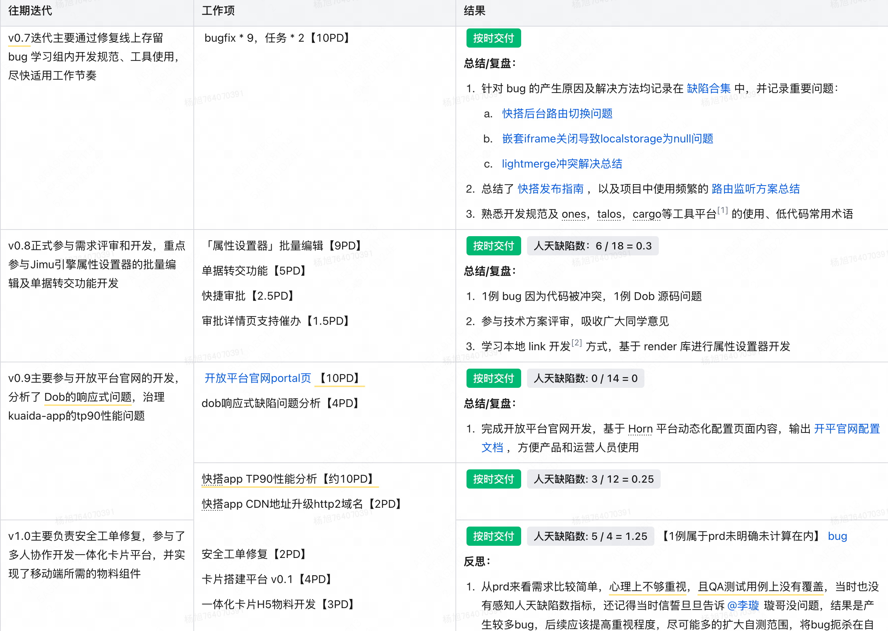
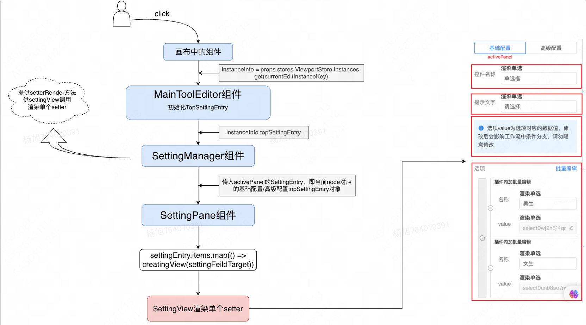

2023 年度述职-办公应用研发-杨旭
企业平台研发部/办公效率研发中心/前端组/办公应用研发组 杨旭 yangxu63 2024 年 1 月
一、工作策略和目标复盘与展望
1 需求完成情况

2 复盘
2.1 属性设置器支持批量编辑
背景
当前单多选组件只能逐个添加或删除，当选项量级较大时，用户只能逐一添加，操作繁琐，耗时长
目标
了解属性设置器 setter 的数据流关系、多个 setter 间如何进行数据交互
实现批量编辑器的混合输入，根据输入内容给出多条解析策略和单条解析策略
产品交互示意图
行动
从单个 setter(ArraySetter)入手，梳理画布中组件到右侧属性设置面板的映射关系，即根据组件的 meta 协议配置，渲染对应 setter，如下图

设置器 UI 和模型的映射关系 from 学谦
考虑编码的规范性和方案的可行性，在技术方案
中给出两种方案，经过评审最终确定新增一个设置器 BatchEditSetter
将 BatchEditSetter 和 ArraySetter 进行组合，写入单多选组件 meta 协议，BatchEditSetter 可通过 getValue 和 setValue 钩子动态获取选项值进行数据回显及选项设置，实现两个 setter 之间的数据同步
用户可以在一定规则内自由输入，为此实现一个 parseModalContent 函数过滤非法输入，满足各种场景下的解析策略
提测时遇到一例 Dob 所导致的响应式断裂 bug，经过分析排查，考虑是其响应式设计问题
思考：
初次接手这个需求时一脸茫然，因为目前对低代码的了解可以说只停留在概念方面，而且对整个设计器很模糊，比如：当用户拖入一个组件时，最右侧属性面板如何更新的，并且修改对应属性值时如何更新至对应字段上；前期主要是研究代码逻辑，遇到问题请教；在尝试获取当前选项值的时候闭门造车，走了一些弯路，而实际上调用 settingFieldTarget.getPropValue('option') 就能得到改字段的属性值，感叹架构设计之奇妙；后面在解析用户输入时穷举了所有场景，保证结果的正确性；最后在完成整个需求时如释重负，且提测质量尚好。相信后续再进行相关开发时会如沐春风
结果
本期按时交付需求，学习了设置器的实现逻辑
批量编辑器能够将用户的一切输入解析生成合法的选项数据
​ 做的好的
遇到批量编辑选项数量超过 200 条时会有性能问题，然后分析了 Dob 源码，找到了其响应式问题缺陷，见 Dob 响应式 bug 分析
鉴于当时属性设置器开发没有文档可参考，产出一篇新增 setter 的开发文档设计器新增 setter 步骤
​ 待提升的
3 例 bug 中的 2 例属于自测不够充分，边角小问题，1 例属于 Dob 源码缺陷，因此后面开发中需不断提升边缘 case 识别能力，尽早发现问题
2.2 快搭自建连接器
背景
当前快搭「连接器」依赖开放平台 API 资源配置，主要面向专业开发者，而快搭用户多为公民开发者，期望提供更简易的连接器配置方式降低用户使用成本
快搭自建连接器分为两期实现：快搭连接器管理 V0.1PRD
、🔄 工作流连接器 2 期（功能建设与优化）
目标
一期支持配置官方连接器和自定义连接器，解决连接器的生产和消费问题
二期补齐原始 API 出入参和连接器执行动作之间的映射规则配置和用户体验优化
重点了解 JsonSchema 编辑器和 JsonMappingEditor 映射规则配置组件的设计原理、和交互规则
行动
由于对连接器概念不了解，采取的策略是体验竞品、学习竞品、对标竞品，主要参考的是资源管理平台连接器实现
分析 JsonSchema 编辑器的数据生成和修改逻辑(基于 SchemaDescription 响应式类实现)，外层通过传入 overridSchemaType 覆盖默认的字段类型，在导入 JSON 时配置校验函数，适配原始 API 入参和执行动作入参的不同需求
通过 transformSchema2Array 函数转换 schema 作为 JsonMappingEditor 组件的输入，解析该组件支持的两种映射规则：
引用规则(连线)：将右侧节点的索引和数据存储在左侧对应节点的 linkIndex 和 linkNode 字段
固定值规则：将用户设置的固定值存储在右侧节点的 fixedValue 字段
两个组件之间的数据存在强耦合关系，区分 API 入参映射和出参映射两种场景进行数据维护(左右两侧的数据集不同 - 建立的映射规则也不同)
监听 schema 各字段变化，实现映射规则的新增/删除，同时映射规则变化时将 schema 中对应字段处理为 jsonPath 格式去动态更新 mappingRules
产品逻辑交互示意图
结果
连接器一期：完成双平台下的连接器生产端配置问题，在估时比较紧张的情况下，保证按时交付
连接器二期：处于提测中，暂无 bug
​ 做的好的
连接器二期更换了产品，对连接器概念比较模糊，前后端 RD 给予了 PM 一些前置输入，共同推进产品设计和落地
复用大量公共组件，减少近一倍代码量，抽取工具函数、常量类型单独定义，增加代码可读性的同时降低维护成本
主人翁意识强，开发中参考竞品实现，给出自己的产品建议和不同 UI 的实现对比供 PM 参考，得到 PM 认可
​ 待提升的
连接器一期中存在研发和产品之间的信息不同步问题，比如校验文案、样式问题等，后面针对这种场景应及时更新、及时同步，避免出现信息差导致问题
连接器一期产生较多 bug，主要没有联调排期，自测时间严重不足，反思后应该多留一些 buffer，给 qa 同学减少压力
2.3 快搭 app 性能分析
背景
用户反映 kuaida-app 系统首屏打开时间较长，页面加载缓慢
目标
分析 kuaida-app 性能问题，根据分析结果，给出对应解决方案，并推进落地
行动
对于性能优化实践较少，与实际业务场景相差甚远，经过请教同事，得到了一些有用输入
对项目进行打包测试，结果发现 agtable 组件和 mtd-react 等组件在一个包，导致加载 mtd-react 的时候也会加载 agtable，这不合理
raptor 上观察 tp90 线超 3000ms，分析了不同端和不同系统的性能曲线，结合页面访问量，得到重点超标页面，然后根据接口性能分析页面的请求耗时
分析结论见快搭 app TP90 性能分析
，最终得出三个结论：
所有页面都会请求包体积较大的 agtable 组件；
系统传输协议是 http1.1，资源并行加载受限
业务请求接口较为耗时，且为串行请求，阻塞页面渲染
根据分析结果给出解决策略：
拆分 agtable 作为独立 chunk
http1.1 升级至 http2
接口性能属于后端能力，需推动后端同学调研分析
结果
为对比优化结果，在优化措施上线前后分别对测试环境和线上环境进行测试，从下表的结果看，测试环境优化效果明显，而线上环境优化效果不及预期，考虑页面的性能瓶颈可能更取决于后端接口效率【最新情况：后端同学已着手接口优化】
优化前后测试结果
​ 做的好的
从 0 到 1，学习了常规的性能优化手段性能优化的基本分析思路
产出一篇 CDN 升级至 h2 域名的文档快搭 app CDN 地址升级 http2 域名
，以备参考
​ 待提升的
拿结果做得不够好，发现了接口请求慢，但没给出强有力的证据来佐证该结果
优化措施上线之后，并没有起到预期的效果结果分析
，后面会持续跟进这一块的动向
二、个人成长复盘与展望
1 个人成长复盘
【角色职责】
业务上以平稳交付为主，遇到风险做到及时抛出，主动发现问题缺陷
，并进行修复
在需求评审、开发和测试过程中始终保持三方人员之间的信息同步，防止因沟通偏差使得交付结果变差
【时间管理】
粗估投入业务开发时间 ≥ 80%，其他时间投入到 prd 和技术方案评审、tt 值班等
后面将通过甘特图形式记录需求迭代和重要举措，明确自己时间分配，利于回顾
【技能】
掌握 react 开发，并能通过本地 link 的方式结合组件库进行开发
学习了不同端的调试方法，使用 raptor 观察页面性能指标等
工程化能力较弱，快搭等项目的依赖包数量多且复杂，遇到问题大部分靠人肉，后续准备进行单点学习，哪里不足补哪里
2 展望
参与常规业务迭代，拿出部分时间学习
，学习模型抽象能力和设计思维
学习 React 常用 hooks 实现原理及高级用法，能够进行页面性能优化
改变 mobx 使用方法，将状态维护收敛至 store 内部（在卡片搭建平台需求中因为状态维护问题产生了一些缺陷）
站在巨人的肩膀：感谢组内每个大佬所给予的帮助，遇到问题的时候总能找到解决办法
