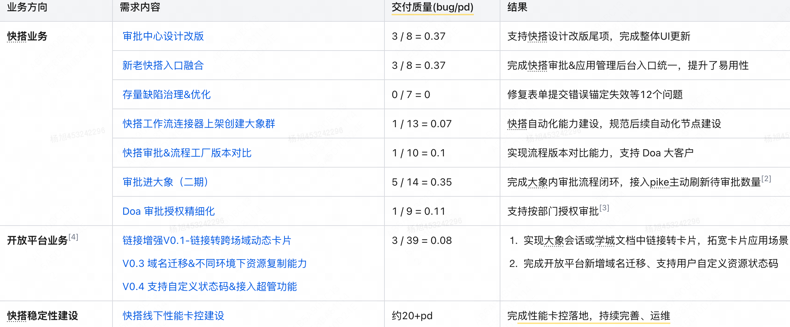
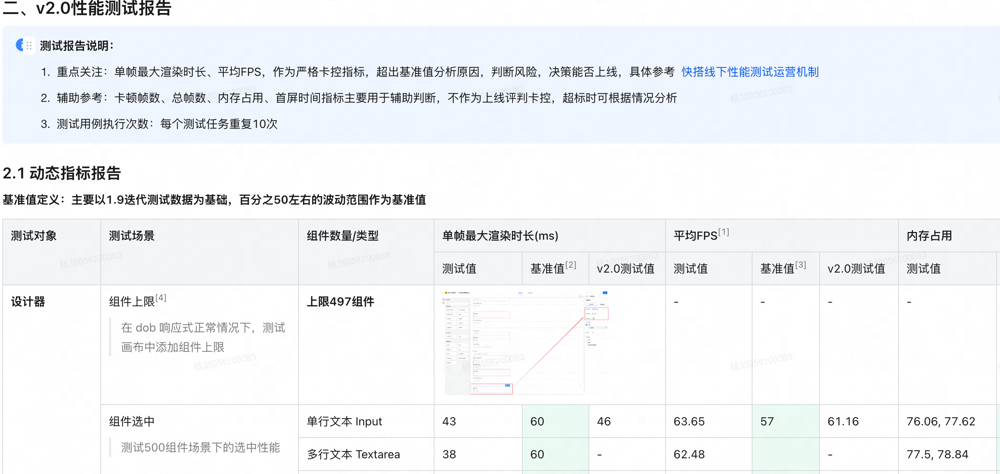
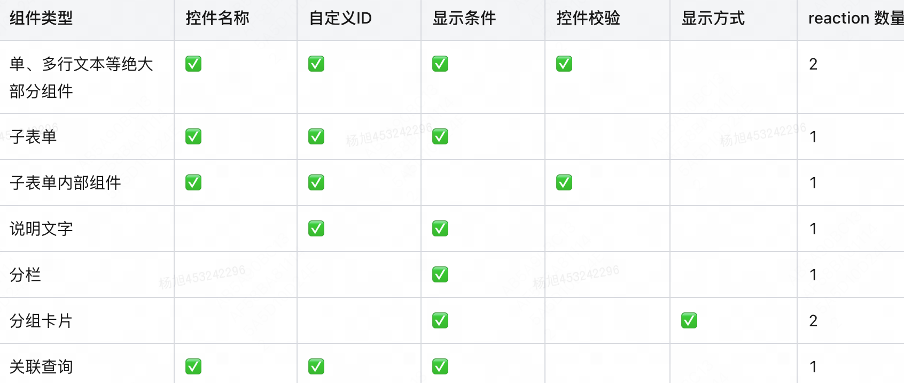
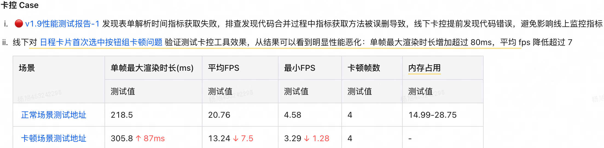

一、工作策略和目标复盘与展望
1、工作总结

总结：

- 上半年负责快搭及开放平台业务开发，下半年全面投入快搭；所有需求按时交付，千行代码 bug 率：26 / 97421 = 0.266‰
- v2.0 作为发布人遇到两例 st 发布问题，整理复盘文档快搭 V2.0 ST 发布问题总结并跟进解决暴露的问题

2、工作复盘
2.1 新老快搭入口融合
背景
快搭应用计划在 v1.5 面向全公司推广，为增加“快搭应用”品牌曝光，实现统一的产品答疑及机器人问答等场景，需要完成后台入口统一
目标
完成快搭审批&快搭应用后台入口融合，收敛所有菜单功能，下线快搭审批后台入口
挑战
产品方案不定，入口融合本质上是两个系统的打通
需要关注的细节较多：关注域名统一(如兼容用户历史收藏链接访问)、融合后实际体验等
行动
分析 Oceanus 配置和项目代码改造，两个主要关注点
对比微前端、链接跳转、iframe 方案，决策采用微前端+链接跳转结合方案（见入口融合技术方案
）
划分项目路由：三个列表页独立，可直接通过微前端嵌入，避免重复开发；搭建页是一个复杂但独立的二级页面，通过链接跳转最为简单
【跨域问题】Oceanus 配置快搭审批路径的 nginx 重定向，nest 上配置快搭审批服务的 http 触发器，使得快搭域名能够访问快搭审批服务
部署测试环境后子应用加载 404 页面，不符合逻辑，排查发现由于快搭域名的特殊性，同时部署了前台和后台服务；且 nest 上快搭审批服务实际配置在 https://kuaida.sankuai.com/approval 路径，导致子应用指向了快搭前台，入口修改为 https://kuaida.sankuai.com/approval 后访问正常
结果
按时交付，交付质量 3 / 8 = 0.37
有个遗漏场景，出现一例线上 nginx 配置导致的问题
用户流程更新后保存流程失败，报错 413 request entity too large，前后端排查发现 schema 体积过大，且 shenpi 域名有请求体大小 1000m 历史配置，kuaida 没有，默认 Nginx 请求体大小 1M
两种解决方法：1）server 端全局配置 client_max_body_size 1000。2）location 路径增加该配置
做得好的
整理入口融合交互对齐
，多次和产品对齐细节和预期，避免返工
做好风险管理，盘点域名切换影响面，规划从测试到发布上线流程说明
待提升的
作为 rd 应努力并关注需求整个链路，特别是对系统服务迁移、改造问题，需要盘点更加全面，前后端互通，最大限度减少遗漏
2.2 工作流支持创建大象群自动化节点
方案：工作流新增连接器节点技术方案
能力规划：🤖 自动化&机器人相关能力拆解&优先级划分
背景
快搭工作流连接器节点用户感知较弱，自动化能力暴露不足，产品上进一步规划官方连接器、自定义连接器两种类型，将官方连接器作为独立节点外漏展示，便于理解和调用

目标
完成连接器改版，显性暴露节点能力
支持后端下发配置，生成节点
新增人员选择组件编辑器，支持人员选择
挑战
前后端需约定一套标准，支持未来扩展
诉求建设通用能力，如字段校验、人员选择组件
行动
盘点画布中连接器节点生成、注册、调用、保存流程
前后端规范一套连接器 schema，扩展能力边界，如选人上下限校验
抽象标准连接器节点配置结构 PublicConnector，通过函数 genPublicConnector 获取后端配置生成独立节点
实现选人组件编辑器 PeopleEditor，支持人员搜索、表单项引用、点击删除 tag
结果
按时交付，提测质量 1 / 13 = 0.07，已有 36 个工作流配置创建大象群节点，共帮助创建 431 个大象群
梳理连接器新增字段输入类型组件开发说明
做得好的
调研竞品实现，对通用连接器节点配置抽象，便于后端下发，减少重复开发成本
2.3 快搭线下性能测试工具建设
方案：快搭线下性能卡控工具建设技术方案
报告举例：
背景 & 目标
mansuda 24 年稳定性建设是目标之一，其中性能也是团队内对齐的关注点之一
快搭的性能现状模糊，缺少线上、线下性能监测、量化能力，与孟杰老师对齐，落地线下性能测试
快搭历史上出现两例问题：1）复制 500 个选项的单多选组件无法渲染；2）2 月份一次发布后设计器加载很慢(5s 以上)，加上其他原因导致回滚过
挑战 & 策略
性能测试不知道测什么、不知道怎么测试
分析 biaoge、薛城基建工具架构、流程，学习 puppeteer 相关，特别鸣谢@mamengjie@qintianxiang@zhaojingchao@zhuminqing 对我的指导
快搭需要测什么、怎么测试
从引擎交互、渲染入手，分析对应引擎不同模块（画布、模型、属性设置器），拆解对应场景
场景抽象：表单组件上限、组件添加、属性编辑、首屏时间等 14 类场景
基准抽象：设计一套标准的组件测试基准，包括 21 种组件类型，5 种组件数量，策略是逐次递增 100 组件类型一致，看清性能变化趋势
划分场景优先级，设计并实现测试用例，见
【快搭特殊】在组件上限场景中，由于不清楚 dob 响应式如何影响 reaction 数量，难以进行，引申出设计器组件上限问题分析
dob 响应式问题可能使设计器“瘫痪”，已经优化过几次校验设计，提高了响应式稳定性。但目前还不清楚新增组件如何影响 reaction 数量？能否得到一个可量化的值，来推断设计器组件上限，为后续开发兜底
结合引擎校验设计，debugger 组件新增、选中等逻辑，发现 reaction 主要受 5 类全局校验属性影响，meta 里每包含一种校验属性，就会创建一个 reaction 用于收集依赖和响应式更新。其中独立于引擎外单独实现的 isOnly 校验属性：控件名称和自定义 ID，不会被计算到全局响应式更新中（只有组件选中时才激活），即理论上 显示条件、控件校验、显示方式三类校验属性实际影响画布渲染。经过验证，新增组件对应 reaction 数量见下表

分析并定义性能指标、基准值定义
指标稳定性保证：异常值处理
单帧最大渲染时间偶现尖刺异常数据处理
首屏时间波动处理
测试结果卡控迭代
测试卡控 SOP：制定线下性能卡控运营机制
在组内同步

- 结果
  一期耗时 15pd 左右实现工具可用，拿到快搭核心场景性能现状
  经过约 5 个迭代沉淀，基本完成线下性能卡控工具落地
  做得好的
  【不畏难】从性能测试小白逐渐过渡到清晰、工具落地
  【有始有终】持续跟进团队发布性能卡控 SOP
  【额外产出】针对 dob 性能问题，进行组件上限问题分析
  ，作为后续设计器性能重要输入
  待提升的
  目前测试一轮约 130 个场景，单场景耗时约 100s，总耗时约 3.6h，后续需要优化测试耗时
  性能测试思考还不够深入，现在复盘动作不够连续，中间有几次是在秉昌老师、孟杰老师的提醒下关注了下一步动作

二、个人成长复盘与展望
个人成长复盘
【认知迭代】
主人翁精神：发声更多、能够更加主动的承担团队事务，如主动提出梳理每周性能运营指标，辅助团队分析和解决问题
极度关注客户：积极承担 bugfix，如收到客诉，当晚修复上线，提高客户满意度
学习并好奇：遇到 nest 部署失败问题，跟进并寻求解决方案，后来一次 node 版本导致线下发布报错给出建议，辅助解决问题
业务迭代上：努力做好技术方案，经过方案评审帮助避免未知风险，对产品适当性 say no
技术项目上：消除畏难情绪，有了一些自己的方法论和思考
【所需支持】
在后续方向上，技术项目和快搭业务迭代希望得到一些输入，如何做好规划
展望
配合坚哥做好快搭交付、持续支持审批进大象需求，保证全量发行（P0）
做好模块 owner ，support 对应能力开发
快搭线下性能卡控优化，自动化能力提升 Midscene.js - AI
连接器能力可以进一步规划，现状难理解、难调用，特别是结合工作流、表单填充
三、建议探讨主题（可选）
外部产品开发调试成本高：如大象客户端的泳道调试使用指南
不 work，有成功的吗
