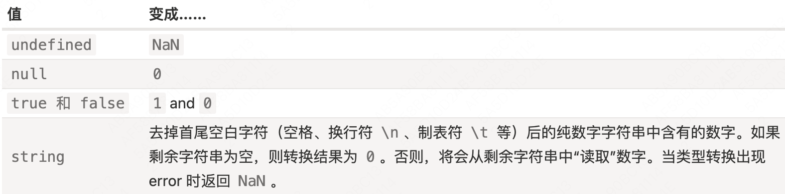
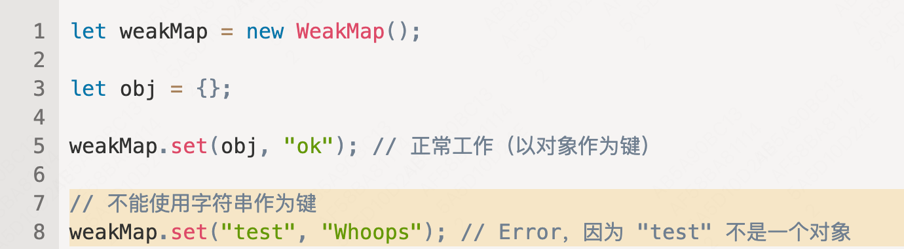
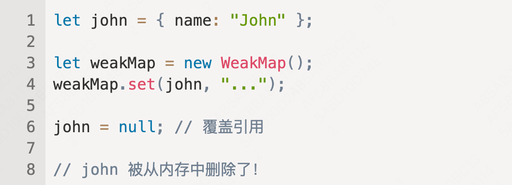
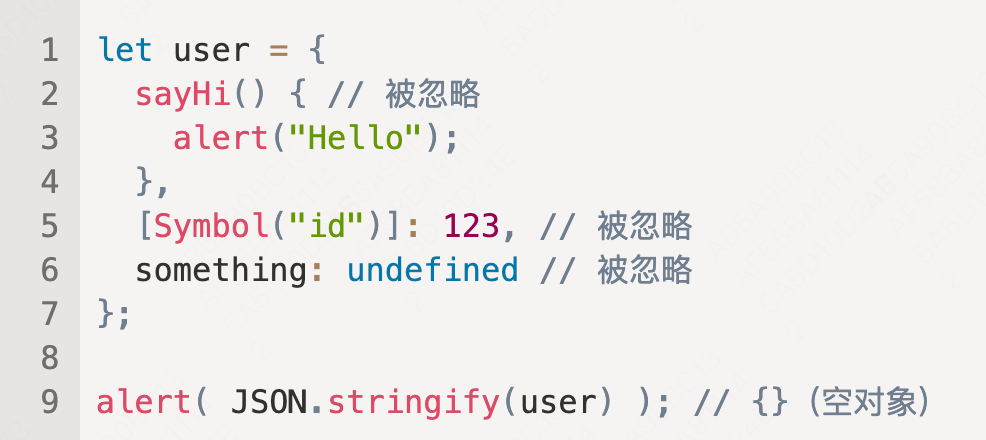
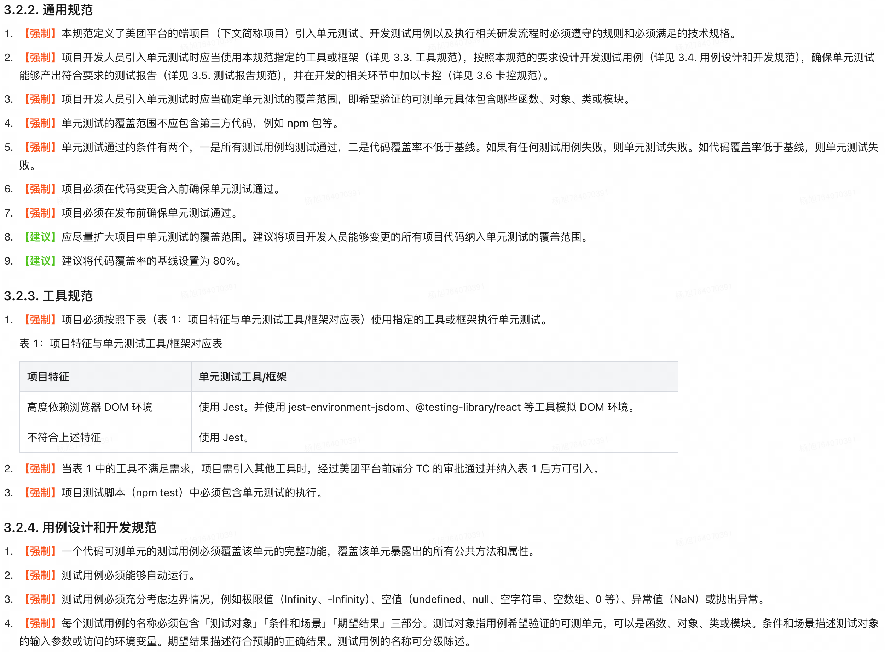

**JavaScript 中，this 是“自由”的，它的值是在调用时计算出来的，并不取决于方法声明的位置，而取决于在“点符号前”的是什么对象。**

- 类型转换
  string 类型转换 -> String()
  number 类型转换 -> Number()
  
- 对象-原始值转换

- WeakMap 和 WeakSet 的用法: [用法了解](https://zh.javascript.info/weakmap-weakset#shi-yong-an-li-huan-cun)
  WeakMap 和 Map 的第一个不同点就是，WeakMap 的键必须是对象，不能是原始值:
  
  现在，如果我们在 weakMap 中使用一个对象作为键，并且没有其他对这个对象的引用 —— 该对象将会被从内存（和 map）中自动清除。
  

**总结**

- WeakMap 是类似于 Map 的集合，它仅允许对象作为键，并且一旦通过其他方式无法访问这些对象，垃圾回收便会将这些对象与其关联值一同删除。
- WeakSet 是类似于 Set 的集合，它仅存储对象，并且一旦通过其他方式无法访问这些对象，垃圾回收便会将这些对象删除。
- 它们的主要优点是它们对对象是弱引用，所以被它们引用的对象很容易地被垃圾收集器移除。
  这是以不支持 clear、size、keys、values 等作为代价换来的……
- WeakMap 和 WeakSet 被用作“主要”对象存储之外的“辅助”数据结构。一旦将对象从主存储器中删除，如果该对象仅被用作 WeakMap 或 WeakSet 的键，那么该对象将被自动清除。

---

**Object.keys/values/entries** 会忽略 symbol 属性
就像 for..in 循环一样，这些方法会忽略使用 Symbol(...) 作为键的属性。
通常这很方便。但是，如果我们也想要 Symbol 类型的键，那么这儿有一个单独的方法 Object.getOwnPropertySymbols，它会返回一个只包含 Symbol 类型的键的数组。另外，还有一种方法 Reflect.ownKeys(obj)，它会返回 所有 键。

**JSON**
JSON 是语言无关的纯数据规范，因此一些特定于 JavaScript 的对象属性会被 JSON.stringify 跳过。即：
函数属性（方法）。
Symbol 类型的键和值。
存储 undefined 的属性。

`JSON.stringify`的完整语法是：
`let json = JSON.stringify(value[, replacer, space])`
`JSON.stringify(user, null, 2)` 的输出 json 字符串属性间会又两个空格缩进

- value: 要编码的值。
- replacer: 要编码的属性数组或映射函数 function(key, value)。
- space: 用于格式化的空格数量。

单元测规范

